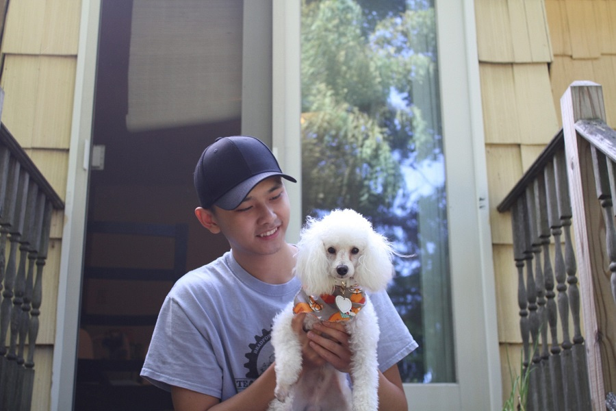
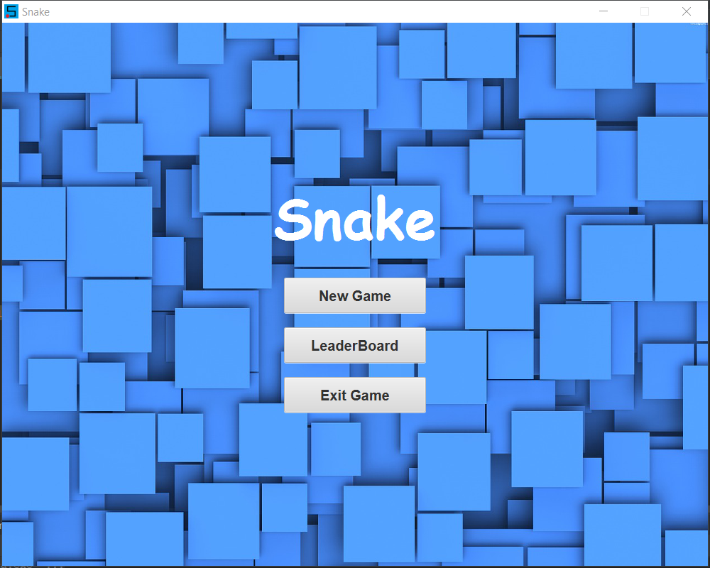
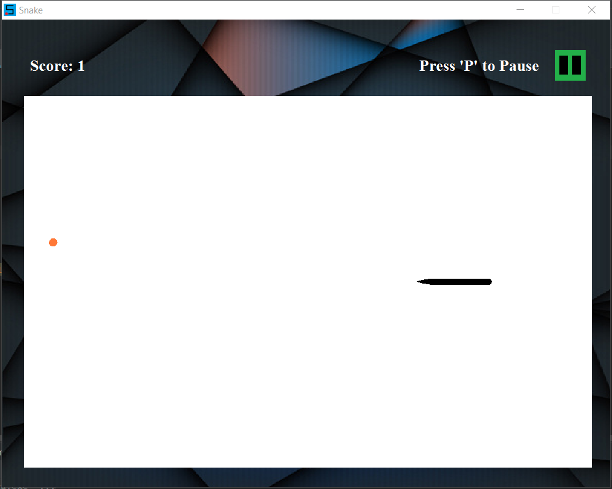
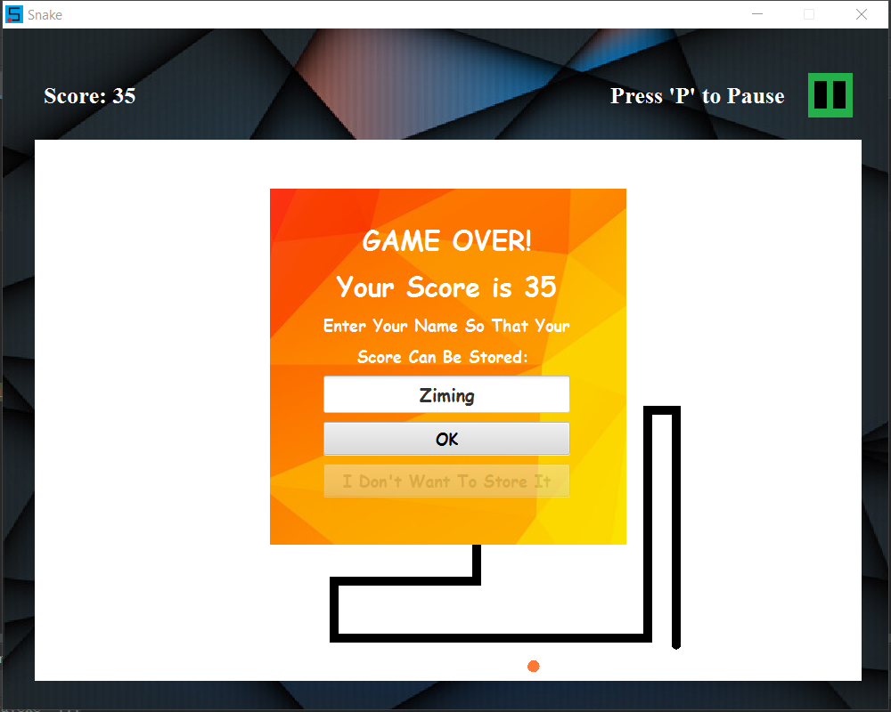
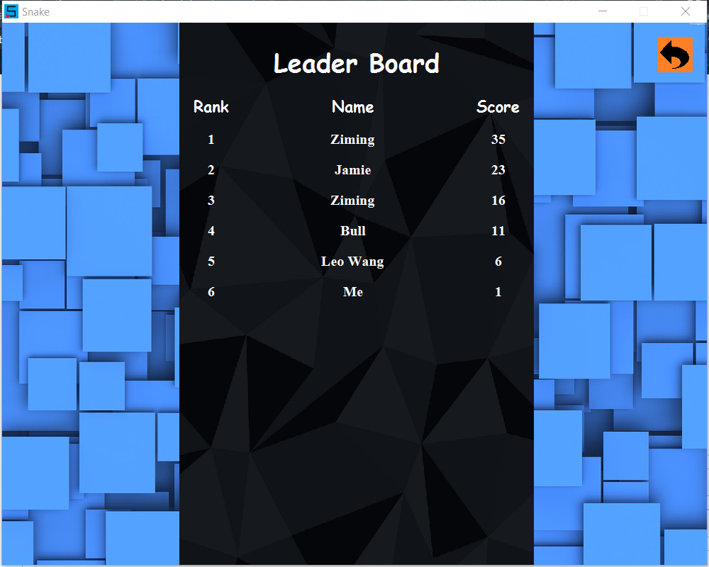
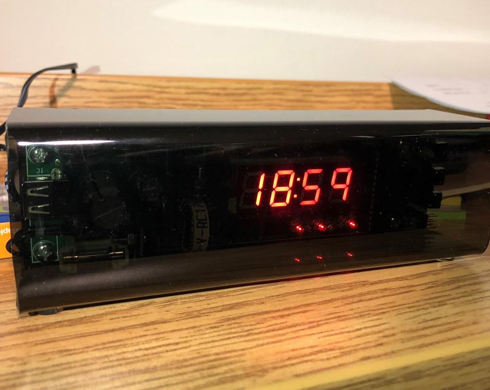
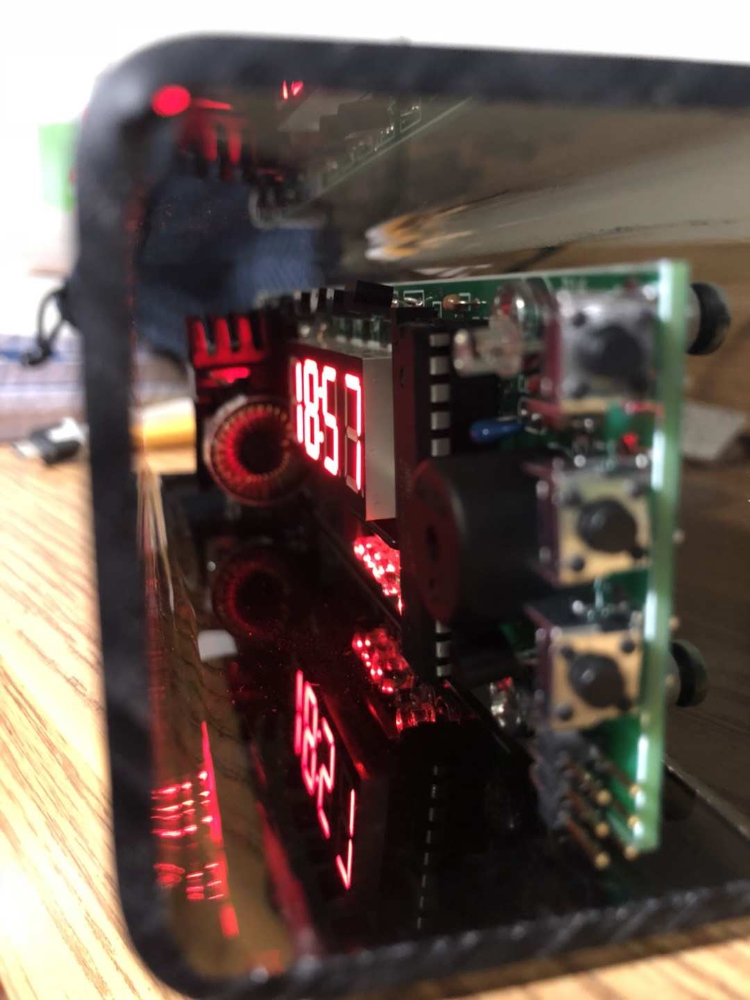

email: "ziming.li@stonybrook.com"
facebook: https://www.facebook.com/ziming.li.56/
github: https://github.com/zimingli1
linkedin: https://www.linkedin.com/in/ziming-li-589b041a0/

## About Me

I'm a college student at Stony Brook University majoring in computer science. With two years of learning experiences, I have gained excellent skills of management for both knowledge and time. My favorite data structure and analyses of algorithms help me develop a bunch of projects. I recently found out that data analysis is really a useful and necessary technique together with fields in computer science. Right now I'm developing more projects related to data science, and I aim to become a specialist of artificial intelligence and data science in the future.

## RESUME
<embed src="Ziming_Resume.pdf" width="100%" height="800px" type="application/pdf">

## Projects
* ### Snake
     * Used 2D Array for constructing a visual plane in Javafx.
     * Implemented multithreads in Java when started gaming.
     * Constructed a leaderboard that records top 10 players’ names and gaming points with Property Class, using Input and Output Streams to load and save status.
     

     
     
     

     

     
     
     

* ### Digital Clock
     * Assembled electrical components in chips.
     * Used C programming to simulate algorithms of clock lights patterns.
     

     
     
     

## Technical Communication Project
* ### User Instruction
     * <embed src="User Instruction Final Draft - Fold A Paper Box.pdf" width="100%" height="800px" type="application/pdf">
* ### Press Release
     * <embed src="Press Release Final Draft.pdf" width="100%" height="800px" type="application/pdf">

